<div align="center">



<br/><br/>

[](#%EF%B8%8F-roadmap)
[](#%EF%B8%8F-roadmap)
[](https://github.com/KathiriyaHardik/ai-lab/commits/main)

[](https://github.com/KathiriyaHardik/ai-lab/commits/main)
[](https://github.com/KathiriyaHardik/ai-lab/stargazers)
[](https://github.com/KathiriyaHardik/ai-lab)

### Practical AI agents for real work, built in public and explained simply.

[Roadmap](#%EF%B8%8F-roadmap) · [Start here](#-start-here) · [Skills covered](#-skills-this-lab-covers) · [How each project is built](#-how-each-project-is-built) · [Follow along](#-follow-along)

</div>

---

## 👋 About this lab

I'm **Hardik**, moving into AI engineering from Germany 🇩🇪. My Master's thesis is on Agentic AI and knowledge management, and I run [ForgeGTM](https://github.com/KathiriyaHardik/forgegtm), a B2B go-to-market agency.

This lab is where I learn by shipping. **Every couple of weeks I build one small AI tool that solves a real problem.** Then I write down exactly how I built it, so you can learn from it, copy it, or build your own.

Every project is:

- **Useful.** It solves a real problem for job seekers, students or small businesses.
- **Small.** One working tool, not a half-finished platform.
- **Explained.** Each project's README covers what it does, how to run it and what I learned.
- **Tested.** No "it worked on my laptop once".

---

## 🗺️ Roadmap

<p><code>▰▰▱▱▱▱▱▱</code> &nbsp;<b>2 of 8 shipped</b></p>

| # | Project | What it does | AI skill it teaches | For | Status |
|:---:|---|---|---|:---:|:---:|
| 01 | [**Job Application Tracker**](projects/01-ai-job-tracker/) | Excel / Google Sheets job-search CRM with follow-ups, pipeline, analytics and a live dashboard | Automation, data modelling, testing | 🎓 | ✅ **Live** |
| 02 | [**Job-Fit Checker**](projects/02-job-fit-checker/) | Paste a job ad and your CV. It gives a Match %, your missing skills and a "Why me?" sentence. Runs on your own computer, free | Using AI models from code, structured output, testing AI answers | 🎓 | ✅ **Live** |
| 03 | **Chat with Your Notes** | Ask questions about your lecture PDFs and get answers with page numbers | RAG: AI that answers from your own documents | 📚 | 🔜 **Next up** |
| 04 | **German Letter Explainer** | Take a photo of an official German letter. It explains what it says, what to do and the deadline (not legal advice) | AI that reads images | 🌍 | ⏳ Soon |
| 05 | **Cover Letter Agent** | Drafts cover letters and recruiter messages in English and German. You approve before anything is sent | Agents with a human in the loop | 🎓 | ⏳ Soon |
| 06 | **Second-Brain Agent** | Searches your notes and connects related ideas | Knowledge management, vector databases | 📚 | ⏳ Soon |
| 07 | **Company Research Agent** | Researches a company and drafts a personal outreach message | Several agents working as a team | 💼 | ⏳ Soon |
| 08 | **First Real Product** | The most popular project, turned into a small web app that real people use | Shipping, users, feedback | 🌍 | ⏳ Soon |

<sub>🎓 Career & job search &nbsp;·&nbsp; 📚 Students & learning &nbsp;·&nbsp; 💼 Business & sales &nbsp;·&nbsp; 🌍 Everyone</sub>

---

## 🚀 Start here

| You are… | Start with |
|---|---|
| 🎓 **Looking for a job** | [Download the Job Application Tracker](https://github.com/KathiriyaHardik/ai-lab/raw/main/projects/01-ai-job-tracker/AI_Job_Application_CRM.xlsx). It's free and ready to use in Excel or Google Sheets. Then check each job with the [Job-Fit Checker](projects/02-job-fit-checker/) before you apply |
| 🧑‍💻 **Learning to build with AI** | Open any project folder and read its README from top to bottom. Each one explains the *why*, not just the code |
| 🧭 **A recruiter or hiring manager** | See [Skills this lab covers](#-skills-this-lab-covers). Each skill links to the project that shows it |

---

## 🧠 Skills this lab covers

| Skill | Shown in | Status |
|---|---|:---:|
| Python automation & testing | [01 Job Tracker](projects/01-ai-job-tracker/): workbook generator plus 141 automated checks run in real Excel | ✅ |
| LLM APIs & structured output | [02 Job-Fit Checker](projects/02-job-fit-checker/): local AI with Ollama, answers forced into a JSON shape, every claim checked against the CV | ✅ |
| Testing AI answers (evals) | [02 Job-Fit Checker](projects/02-job-fit-checker/): 47 fast tests with a fake AI plus 11 quality checks with the real model | ✅ |
| RAG (answers from your own documents) | 03 Chat with Your Notes | 🔜 |
| Multimodal AI (images → text) | 04 German Letter Explainer | ⏳ |
| AI agents & human-in-the-loop | 05 Cover Letter Agent | ⏳ |
| Vector databases & knowledge management | 06 Second-Brain Agent | ⏳ |
| Multi-agent systems | 07 Company Research Agent | ⏳ |
| Deploying a real AI product | 08 First Real Product | ⏳ |

---

## 🧱 How each project is built

Every project follows the same five steps, so you always know where to look:

```text
1. Problem     → who has this problem, and why it matters
2. Build       → the smallest version that actually works
3. Test        → automated checks, not "it worked once"
4. Explain     → README: what it does, how to run it, what I learned
5. Share       → a short build log on social media
```

```text
ai-lab/
├── assets/                    ← lab banner
└── projects/
    ├── 01-ai-job-tracker/     ✅ live
    ├── 02-job-fit-checker/    ✅ live
    └── 03-chat-with-notes/    🔜 next
```

---

## 📣 Follow along

- ⭐ **Star this repo** to keep track of new projects.
- 📸 **Instagram:** launching soon, with short demos and explainers for every project.
- 💼 **LinkedIn:** the same build logs, with more detail.
- 🐙 **GitHub:** [@KathiriyaHardik](https://github.com/KathiriyaHardik)

Got an idea for a project, or found a bug? [Open an issue](https://github.com/KathiriyaHardik/ai-lab/issues). I read every one.

---

<div align="center">
<sub>Hardik's AI Lab · built in public from Germany 🇩🇪 · one project at a time</sub>
</div>
