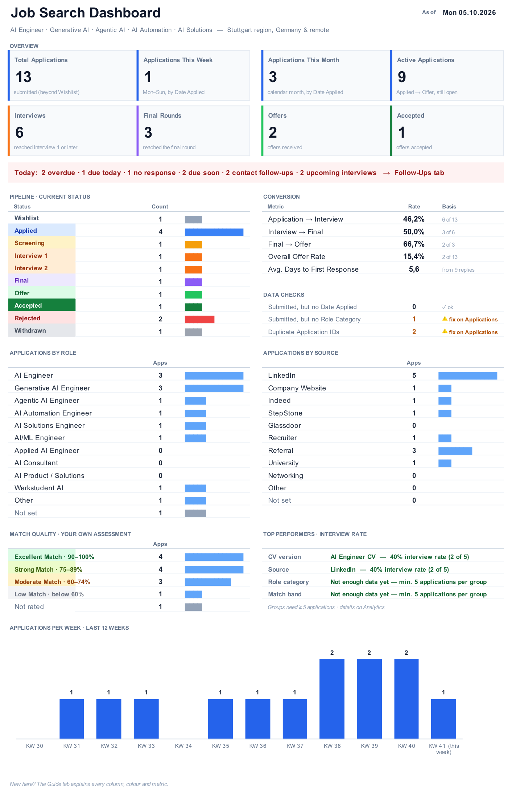
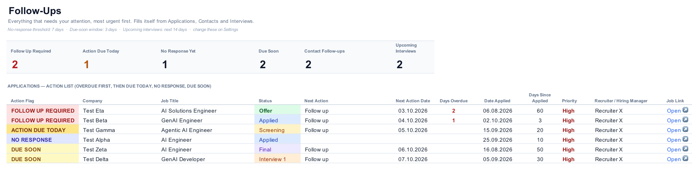
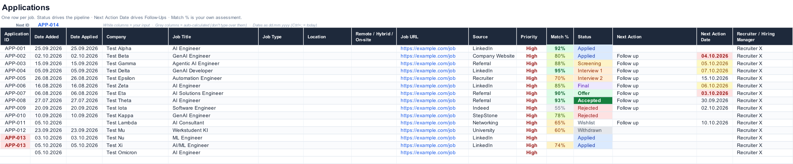
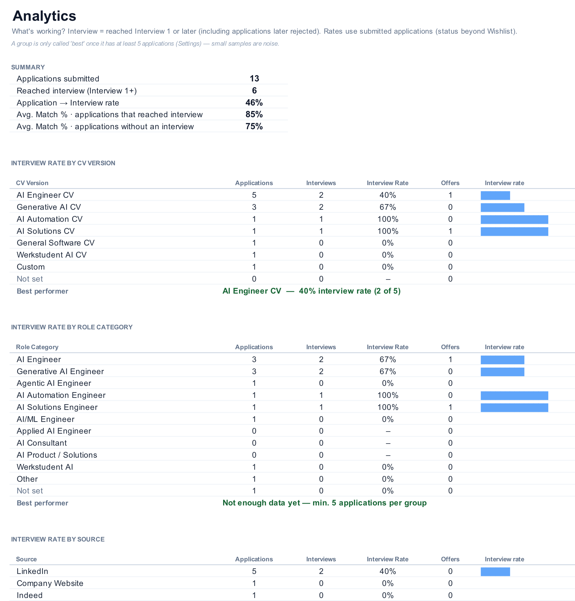
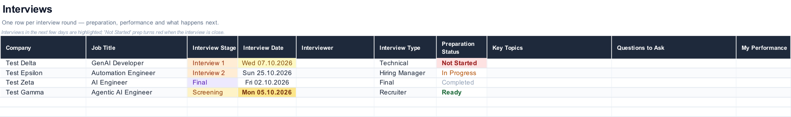
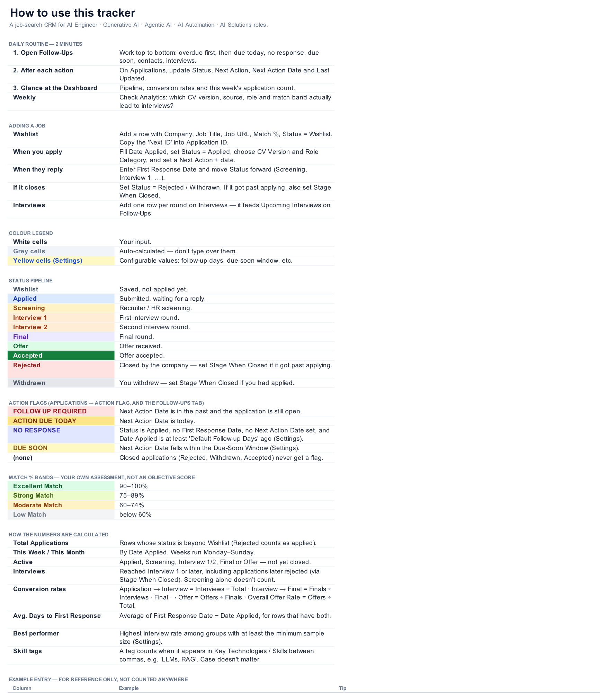
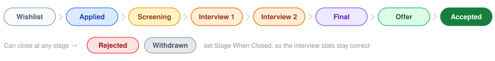
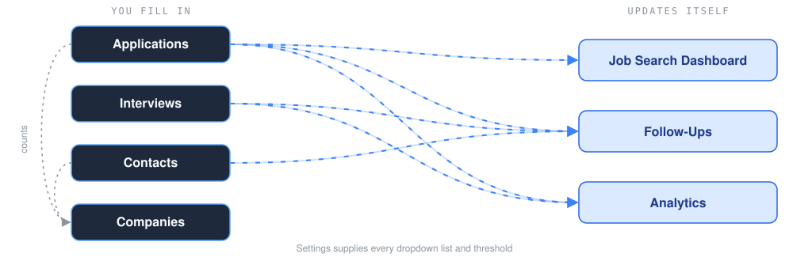

<div align="center">


<br/><br/>

[](#-quick-start)
[](#-compatibility)
[](#-build--test-from-source)
[](#-how-it-was-tested)
[](#-compatibility)

[](https://github.com/KathiriyaHardik/ai-lab/commits/main)
[](https://github.com/KathiriyaHardik/ai-lab)
[](https://github.com/KathiriyaHardik/ai-lab/stargazers)

### What have I applied to? · Where am I in the process? · What do I need to do today? · What's actually working?

One workbook answers all four questions. It was built for an **AI Engineer · Generative AI · Agentic AI · AI Automation · AI Solutions** job search in Germany 🇩🇪

**[⬇️ Download the tracker](https://github.com/KathiriyaHardik/ai-lab/raw/main/projects/01-ai-job-tracker/AI_Job_Application_CRM.xlsx)** &nbsp;·&nbsp;
[Tour](#-tour) &nbsp;·&nbsp; [Quick start](#-quick-start) &nbsp;·&nbsp; [How it works](#-how-it-works) &nbsp;·&nbsp; [Make it yours](#%EF%B8%8F-make-it-yours) &nbsp;·&nbsp; [Build & test](#-build--test-from-source)

</div>

---

## ✨ Highlights

<table>
<tr>
<td width="33%" valign="top">

### 📋 Pipeline tracker
25 columns per application with 10 colour-coded stages from **Wishlist** to **Accepted**. Dropdowns, filters and frozen headers throughout.

</td>
<td width="33%" valign="top">

### ⏰ Follow-up engine
Flags applications as **overdue**, **due today**, **no response** or **due soon**, sorted with the most urgent first. You set every threshold.

</td>
<td width="33%" valign="top">

### 📊 Live dashboard
KPIs, the current pipeline, conversion rates, breakdowns by role, source and match, and a 12-week chart. It updates as you type.

</td>
</tr>
<tr>
<td valign="top">

### 🧪 Strategy analytics
Interview rate by **CV version**, **role**, **source** and **Match %**. A group is only called "best" once it has enough applications.

</td>
<td valign="top">

### 🤖 Built for AI roles
10 AI role categories (Agentic AI, GenAI, AI Automation…) and 14 tech tags (LLMs, RAG, Vector Databases…) that Analytics counts automatically.

</td>
<td valign="top">

### 🔒 Plain spreadsheet
No macros, no add-ins, nothing to enable. Named ranges, dropdowns and conditional formatting only, so it opens anywhere.

</td>
</tr>
</table>

---

## 🎬 Tour

<p align="center">
  
  <br/><sub><b>Job Search Dashboard</b>, shown with demo data. The file you download is empty.</sub>
</p>

<details>
<summary><b>⏰ Follow-Ups</b>: what to do today, most urgent first</summary>
<br/>


The list fills itself from Applications, Interviews and Contacts. Closed applications (Rejected, Withdrawn, Accepted) never show up here.
</details>

<details>
<summary><b>📋 Applications</b>: one row per job</summary>
<br/>


Status cells, Match % and Next Action Dates are colour-coded. Duplicate IDs turn red. Grey columns on the right are calculated for you.
</details>

<details>
<summary><b>🧪 Analytics</b>: what's working</summary>
<br/>

</details>

<details>
<summary><b>🎤 Interviews</b>: preparation, performance, next steps</summary>
<br/>


If preparation is still *Not Started* when an interview is only days away, the cell turns red.
</details>

<details>
<summary><b>📖 Guide</b>: every column, colour and metric explained inside the workbook</summary>
<br/>

</details>

---

## 🚀 Quick start

1. **[Download `AI_Job_Application_CRM.xlsx`](https://github.com/KathiriyaHardik/ai-lab/raw/main/projects/01-ai-job-tracker/AI_Job_Application_CRM.xlsx)** and open it in Excel. For Google Sheets, use *File → Import*.
2. Add a job on **Applications** with Status = `Wishlist`. Copy the **Next ID** shown above the header into Application ID.
3. When you apply, fill in **Date Applied**, set Status = `Applied`, and add a **Next Action** and **Next Action Date**.
4. Each morning, open **Follow-Ups** and work through it from the top.

> [!TIP]
> If you keep your filled-in copy inside this repo, name it **`my-tracker.xlsx`**. Files named `my-*.xlsx` are git-ignored, so your contacts and notes can't be pushed by accident.

<details>
<summary><b>📆 The 2-minute daily routine</b></summary>
<br/>

| When | Do this |
|---|---|
| ☀️ Every morning | Open **Follow-Ups** and handle overdue items, then due today, no response, due soon, interviews and contacts |
| ✍️ After every action | Update **Status**, **Next Action**, **Next Action Date** and **Last Updated** (<kbd>Ctrl</kbd>+<kbd>;</kbd> inserts today's date) |
| 📈 Weekly | Check **Analytics** to see which CV version, source, role and match band actually lead to interviews |

</details>

---

## 🔄 How it works

**The status pipeline.** Each stage has its own colour, and the workbook uses the same colours everywhere:

<p align="center"></p>

**What feeds what.** You only type into the four input tabs. The three blue tabs calculate themselves:

<p align="center"></p>

### Action flags

| Flag | When it appears |
|---|---|
| 🔴 **FOLLOW UP REQUIRED** | Next Action Date is in the past and the application is still open |
| 🟠 **ACTION DUE TODAY** | Next Action Date is today |
| 🔵 **NO RESPONSE** | Status is *Applied*, there's no reply and no Next Action Date set, and it's been at least *Default Follow-up Days* (7) |
| 🟡 **DUE SOON** | Next Action Date falls within the due-soon window (3 days) |

### Match % (your own assessment, not an objective score)

| 🟢 Excellent | 🟩 Strong | 🟨 Moderate | ⬜ Low |
|:---:|:---:|:---:|:---:|
| 90–100% | 75–89% | 60–74% | below 60% |

<details>
<summary><b>📐 How every number is calculated</b></summary>
<br/>

| Metric | Definition |
|---|---|
| **Total Applications** | Rows whose status is past Wishlist. Rejected counts as applied. |
| **This Week / This Month** | Counted by Date Applied. Weeks run Monday to Sunday. |
| **Active** | Applied, Screening, Interview 1/2, Final or Offer, and not closed |
| **Interviews** | Applications that reached Interview 1 or later, including ones later rejected (tracked by *Stage When Closed*). Screening alone doesn't count. |
| **Application → Interview** | Interviews ÷ Total Applications |
| **Interview → Final → Offer** | Finals ÷ Interviews, then Offers ÷ Finals |
| **Avg. Days to First Response** | First Response Date − Date Applied, averaged over rows that have both |
| **Best performer** | Highest interview rate among groups with at least *Minimum Applications* (5) |
| **Skill tags** | A tag counts when it appears in *Key Technologies / Skills* separated by commas. Case doesn't matter. |

</details>

---

## ⚙️ Make it yours

Everything adjustable lives on the **Settings** tab. Change a yellow cell and every flag, highlight and list updates.

| Setting | Default | What it controls |
|---|:---:|---|
| Default Follow-up Days | `7` | How long an application waits without a reply before it's flagged **NO RESPONSE** |
| Due-Soon Window | `3` | How many days ahead Next Action, Follow-up and Next Step dates turn yellow |
| Upcoming Interview Window | `14` | How far ahead Follow-Ups lists interviews |
| Minimum Applications for "Best" | `5` | How many applications a group needs before Analytics names it the best performer |

You can rename items in any dropdown list (CV versions, sources, role categories, industries…). The only exceptions are **Status** and **Stage When Closed**, because formulas match those names exactly.

---

## 🛠 Build & test from source

The workbook is generated by code, so every formula, colour and dropdown is reviewable and reproducible.

```bash
cd projects/01-ai-job-tracker
python3 -m venv .venv && .venv/bin/pip install openpyxl

.venv/bin/python build_tracker.py      # → AI_Job_Application_CRM.xlsx (clean, ready to use)
.venv/bin/python verify_tracker.py     # → end-to-end test in Microsoft Excel (macOS)
```

> [!WARNING]
> `build_tracker.py` overwrites `AI_Job_Application_CRM.xlsx`. Keep your filled-in copy under a different name.

### 🧪 How it was tested

`verify_tracker.py` uses **real Microsoft Excel** as the calculation engine:

1. It builds a copy of the workbook filled with dummy rows that cover every status, flag and breakdown.
2. It opens the copy in Excel and reads the calculated values back over AppleScript.
3. It compares them against an **independent Python model** of the tracker's rules: dashboard KPIs, conversion rates, follow-up lists and their order, analytics tables, "best performer" callouts, weekly counts, skill tags and company counts.
4. It changes *Default Follow-up Days* on Settings and checks that the flags follow.
5. It counts formula errors on every sheet, for both the dummy-data copy and the clean file.

```text
sample workbook: 0 formula errors across 9 sheets
clean workbook: 0 formula errors across 9 sheets
All 141 checks passed.
```

The test also catches mistakes: running it against a deliberately wrong model produces failures.

---

## 🧭 Compatibility

| Platform | Status |
|---|---|
| Microsoft Excel for Mac 16.x | ✅ Verified with the automated test above, in German locale |
| Microsoft Excel for Windows 2010+ | 🟢 Uses only Excel 2010-era functions, but not tested separately |
| Google Sheets | 🟡 Built for import (no macros, tables or dynamic arrays, and conditional formatting stays on its own sheet), but **not yet verified** |
| LibreOffice | ⚪ Not tested |

---

## 📁 Project structure

```text
01-ai-job-tracker/
├── AI_Job_Application_CRM.xlsx   ← the tracker (empty, ready to use)
├── build_tracker.py              ← generates the workbook (openpyxl)
├── verify_tracker.py             ← end-to-end test in Microsoft Excel
└── docs/images/                  ← banner + screenshots for this README
```

<details>
<summary><b>💡 What I learned building it</b></summary>
<br/>

- **openpyxl writes formulas but never calculates them.** Testing them needs a real spreadsheet engine. Excel's sandbox blocks scripted saves, so the test reads values from the open workbook over AppleScript instead.
- **Listing records without `FILTER` or `SORT`.** Each row gets a numeric sort key (urgency × 100000 + date + row ÷ 10000). `SMALL(key, k)` and `MATCH` then return the k-th most urgent item, in any spreadsheet app.
- **Google Sheets conditional formatting can't reference other sheets.** Each sheet keeps a hidden local copy of the thresholds it needs.
- **Auto-numbered IDs and sorting don't mix.** A formula like `ROW()` renumbers everything when you sort. The ID is typed in, helped by a live "Next ID" cell and duplicate highlighting.
- **Honest analytics.** A 1-of-1 interview rate is 100% but tells you nothing, so "best performer" requires a minimum sample size.

</details>

---

<div align="center">
<sub>Part of <a href="../../">Hardik’s AI Lab</a> · built by <a href="https://github.com/KathiriyaHardik">Hardik Kathiriya</a> · Python × openpyxl × Microsoft Excel</sub>
</div>
