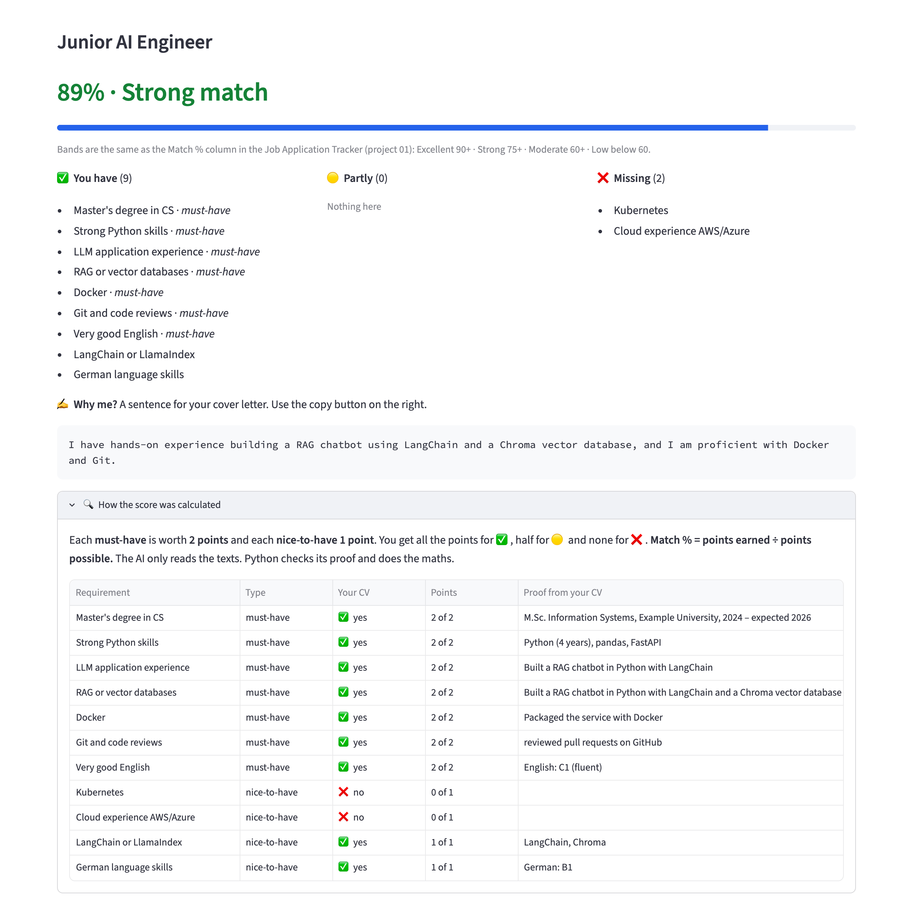

<div align="center">



<br/><br/>

[](#-quick-start)
[](#-private-by-design)
[](#-quick-start)
[](#-how-it-was-tested)

### Is this job a good fit for me? · What am I missing? · How do I say why I fit?

Paste a job ad and your CV. You get a **Match %**, the skills you're **missing** (must-haves first) and a **"Why me?"** sentence for your cover letter. English and German job ads both work.

**The AI runs on your own computer, so your CV never leaves it.** No account, no API key, no cost.

[Tour](#-tour) &nbsp;·&nbsp; [Quick start](#-quick-start) &nbsp;·&nbsp; [How it works](#-how-it-works) &nbsp;·&nbsp; [How it was tested](#-how-it-was-tested) &nbsp;·&nbsp; [What I learned](#-what-i-learned)

</div>

---

## ✨ Highlights

<table>
<tr>
<td width="33%" valign="top">

### 🎯 A score you can check
The AI only reads. **Python calculates the Match %** from a clear rule, and you can open a table that shows every point.

</td>
<td width="33%" valign="top">

### 🔍 Proof for every "yes"
For each skill it says you have, the AI must quote your CV. **If the quote isn't really in your CV, it doesn't count.**

</td>
<td width="33%" valign="top">

### ❌ Gaps first
Missing must-haves come before missing nice-to-haves, so you know what to learn or explain first.

</td>
</tr>
<tr>
<td valign="top">

### ✍️ "Why me?" sentence
One or two sentences in the job ad's language, using only facts from your CV. Copy them into your cover letter.

</td>
<td valign="top">

### 🔒 Private by design
Runs with [Ollama](https://ollama.com) on your laptop. The web page only opens on your own computer and sends no usage data.

</td>
<td valign="top">

### 🔗 Works with project 01
Same Match % bands as the [Job Application Tracker](../01-ai-job-tracker/), so you can copy the number straight into it.

</td>
</tr>
</table>

---

## 🎬 Tour

<p align="center">
  
  <br/><sub>The built-in example: a fictional AI student's CV checked against a fictional Junior AI Engineer job ad.</sub>
</p>

---

## 🚀 Quick start

You need a computer with **at least 16 GB of memory** (RAM). Everything below is free. I built and tested it on a Mac. Ollama, Python and Streamlit also run on Windows and Linux, but I haven't tested it there.

**1. Install Ollama and download the AI model (one time, about 10 GB)**

Download the app from [ollama.com](https://ollama.com/download) and open it. On a Mac with Homebrew you can run `brew install --cask ollama-app` instead. Then:

```bash
ollama pull gemma4:e4b
```

> [!IMPORTANT]
> On a Mac, use the **official Ollama app**. The Homebrew *formula* (`brew install ollama`) was missing the part that forces answers into a fixed shape when I built this, and the checker shows an error with it.

**2. Install uv** (it sets up Python and the libraries for you)

```bash
brew install uv          # Mac. For Windows and Linux, see docs.astral.sh/uv
```

**3. Start the checker**

```bash
cd projects/02-job-fit-checker
uv run streamlit run app.py
```

Open **http://localhost:8501**. Click **Try it with an example** to see how it works, then paste a real job ad and upload your CV (PDF or text).

<details>
<summary><b>⌨️ Use it from the command line instead</b></summary>
<br/>

```bash
uv run jobfit.py samples/job_ai_engineer_en.txt samples/cv_ai_student.txt
uv run jobfit.py my-job.txt my-cv.pdf
```

</details>

<details>
<summary><b>🔄 Try a different AI model</b></summary>
<br/>

Other Ollama models with structured output should work too, but I've only tested `gemma4:e4b`. Download one, then check it with the same quality checks:

```bash
JOBFIT_MODEL=qwen3.5:9b uv run streamlit run app.py
uv run evaluate.py --model qwen3.5:9b        # run the same quality checks on it
```

To let the model "think" before it answers (slower; see [What I learned](#-what-i-learned)), start it with `JOBFIT_THINK=1`.

</details>

> [!TIP]
> Keep your own CV and job ads out of git: name them **`my-*`** (for example `my-cv.pdf`). Files with that name are git-ignored in this folder.

> [!NOTE]
> The Match % is a guide, not a hiring decision. Real recruiters also look at things the text doesn't show. Use it to find gaps and to decide where to spend your time.

---

## 🔄 How it works

```text
            ┌────────────┐   step 1: AI reads ONLY the job ad
 Job ad ───▶│     AI     │──▶ list of requirements (must-have / nice-to-have)
            └────────────┘                   │
                                             ▼
            ┌────────────┐   step 2: AI answers EVERY requirement
 Your CV ──▶│     AI     │──▶ yes / partly / no + a quote from your CV as proof
            └────────────┘                   │
                                             ▼
            ┌────────────┐   step 3: Python checks each quote is really in your CV
            │   Python   │──▶ no proof = counts as missing
            └────────────┘                   │
                                             ▼
            ┌────────────┐   step 4: Python does the maths
            │   Python   │──▶ Match %, band, lists, "Why me?"
            └────────────┘
```

**Why two AI steps?** In my first version the AI read the job ad and the CV together. It quietly left out the requirements the CV didn't cover, and the score came out at 100% when it should have been 89%. Now the AI writes the requirement list **before** it sees the CV. In step 2 the answer has **one required slot per requirement**, so it can't skip any.

**Why does Python do the maths?** Small AI models are bad at consistent numbers. Here the AI only answers yes / partly / no, and a simple rule turns those answers into the score:

| | ✅ yes | 🟡 partly | ❌ no |
|---|:---:|:---:|:---:|
| **Must-have** | 2 points | 1 point | 0 |
| **Nice-to-have** | 1 point | 0.5 points | 0 |

**Match % = points earned ÷ points possible.** The bands are the same as in the Job Application Tracker:

| 🟢 Excellent | 🟩 Strong | 🟨 Moderate | ⬜ Low |
|:---:|:---:|:---:|:---:|
| 90–100% | 75–89% | 60–74% | below 60% |

**How "fixed shape" answers work.** `jobfit.py` describes each answer as a [pydantic](https://docs.pydantic.dev) model. pydantic turns that into a JSON schema, Ollama forces the AI's reply to follow it, and pydantic checks the reply again. If the reply is broken anyway, the checker asks once more with a little randomness, so it doesn't make the same mistake twice.

---

## 🔒 Private by design

- The AI model runs in Ollama on your computer. The job ad and your CV are only sent to `localhost`.
- The web page only listens on your own computer (`server.address = "localhost"`).
- Streamlit's anonymous usage statistics are switched off in [`.streamlit/config.toml`](.streamlit/config.toml).
- All sample CVs and job ads in [`samples/`](samples/) are made up.

---

## 🧪 How it was tested

**1. Fast tests (47 checks, under a second, no AI needed)**

```bash
uv run pytest
```

A fake AI plays back prepared answers, so these test all of the Python logic:

- **Scoring:** points, bands, rounding and the "must-haves first" order
- **Proof checking:** line breaks, bullets, quotes, dashes and "…" in quotes are handled. Made-up quotes are caught, and "Java" doesn't match "JavaScript".
- **The two steps:** step 1 never sees the CV, step 2 has a slot for every requirement, and "Why me?" uses the job ad's language
- **Errors:** Ollama not running, model not downloaded, broken or stuck AI answers (one retry with a little randomness), empty or too-long input, scanned or broken PDFs
- **The web page:** Streamlit's built-in `AppTest` clicks through the example and checks what appears

I also broke the scoring on purpose to make sure the tests notice. They did.

**2. Quality checks with the real AI (11 checks, a few minutes)**

```bash
uv run evaluate.py
```

Exact scores depend on the model, so this checks what any good fit checker must get right, using 3 fictional CVs and 2 fictional job ads:

| Check | Result |
|---|---|
| A matching CV scores 10+ points above a partly matching one, which scores 10+ above an unrelated one | ✅ 89% > 33% > 17% |
| The matching CV is at least *Moderate*, the unrelated one is *Low* | ✅ Strong / Low |
| Known facts: Python is found, Kubernetes is missing, the nurse isn't credited with Python | ✅ |
| A German job ad gets a German "Why me?" | ✅ *"Ich verfüge über einen Masterabschluss in Information Systems und habe praktische Erfahrung mit LLMs…"* |
| Same input 3 times, same score | ✅ 89, 89, 89 |
| At least 80% of the AI's "yes / partly" claims have real proof in the CV | ✅ 42 of 42 |

```text
Model: gemma4:e4b · thinking off

  strong      89% Strong    have  9 · partly  0 · missing  2 · claims without proof 0 ·   12 s
  partial     33% Low       have  3 · partly  1 · missing  7 · claims without proof 0 ·   12 s
  unrelated   17% Low       have  2 · partly  0 · missing  9 · claims without proof 0 ·   11 s
  german     100% Excellent have  9 · partly  0 · missing  0 · claims without proof 0 ·   12 s

Average time per check: 12 seconds
All 11 checks passed.
```

The German case scores 100% because the sample CV really covers every requirement of that ad (Python, LLMs, Git, German B1, RAG, Docker and Streamlit).

Tested on a MacBook with an Apple M5 chip and 16 GB of memory.

---

## 📁 Project structure

```text
02-job-fit-checker/
├── app.py                 ← the web page (Streamlit)
├── jobfit.py              ← the checker: AI calls, proof check, scoring, command line
├── evaluate.py            ← quality checks with the real AI model
├── tests/                 ← fast tests with a fake AI
├── samples/               ← fictional job ads (EN + DE) and CVs
├── pyproject.toml         ← dependencies (uv)
├── .streamlit/config.toml ← keeps the page local and private
└── docs/images/           ← banner + screenshot for this README
```

---

## 💡 What I learned

- **Don't let the AI see the CV while it reads the job ad.** My first version did both in one step. The AI quietly left out Kubernetes and AWS, the two things the CV didn't have, and scored the CV at 100% instead of 89%. Splitting the work into two steps fixed it.
- **Short labels lose meaning.** The AI shortened *"Computer Science, Information Systems or a similar field"* to *"Master's degree in CS"*, then marked an Information Systems degree as missing. Now every requirement keeps the ad's own words next to its short name.
- **Fixed-shape answers can get stuck.** JSON allows any amount of blank space, and twice the model (with "thinking" on) wrote empty lines until it was stopped. Now every answer has a length limit, the retry uses a little randomness (temperature 0.3) so it doesn't repeat the same mistake, and thinking is off by default. That also cut a check from about 45 to 12 seconds, and all 11 quality checks still pass.
- **Let Python check the AI's proof.** In the final test run all 42 claims had real proof. The check costs nothing and catches the day a model invents a skill.
- **Temperature 0 makes results repeatable.** The same CV and job ad gave 89% three times in a row, which matters if you compare jobs against each other.
- **Check the install, not just the code.** Homebrew's `ollama` formula was missing the library that forces answers into JSON (`structured output is unavailable`). The official Ollama app has it, and the checker now explains this error in plain words.

---

<div align="center">
<sub>Part of <a href="../../">Hardik’s AI Lab</a> · built by <a href="https://github.com/KathiriyaHardik">Hardik Kathiriya</a> · Python × Ollama × Streamlit</sub>
</div>
